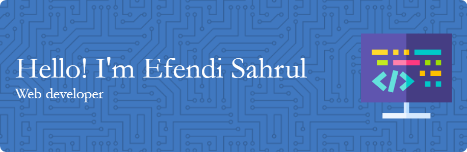

## Hello everyone! I'm Efendi Sahrul 👋

<!--
**sahrul-dwann/sahrul-dwann** is a ✨ _special_ ✨ repository because its `README.md` (this file) appears on your GitHub profile.

Here are some ideas to get you started:

- 🔭 I’m currently working on ...
- 🌱 I’m currently learning ...
- 👯 I’m looking to collaborate on ...
- 🤔 I’m looking for help with ...
- 💬 Ask me about ...
- 📫 How to reach me: ...
- 😄 Pronouns: ...
- ⚡ Fun fact: ...
-->
🔭 I’m currently working on [**@Dicoding**](https://www.dicoding.com/)
🌱 I’m currently learning [**ReactJS**](https://react.dev/)

##### skills

##### 📫 How to reach me:

 